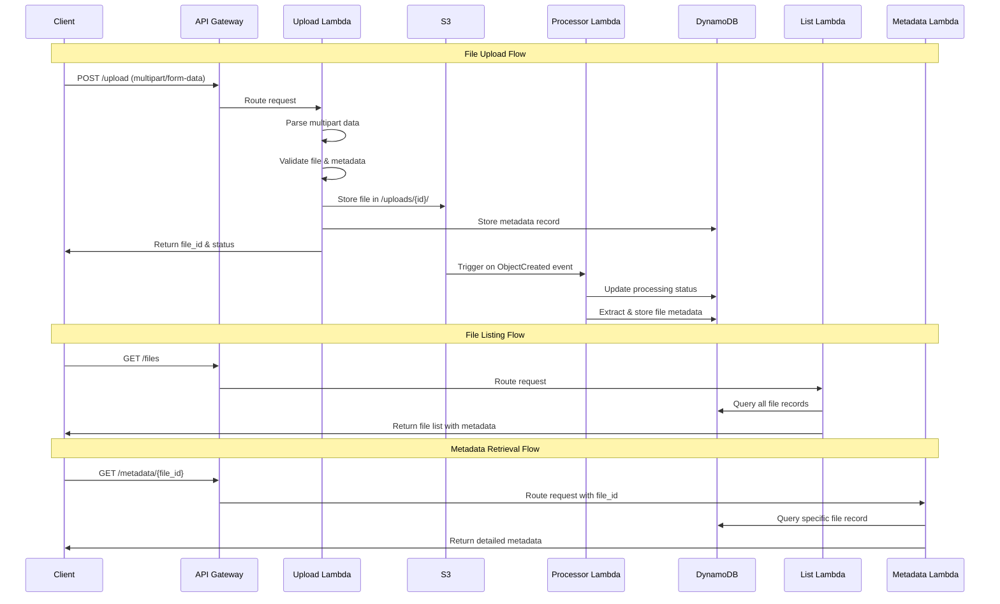

# File Manager Service - Request Flow Sequence Diagram

This diagram shows the complete request flow for all three main operations in the File Manager Service.

## Request Flow Sequence

## Flow Descriptions

### 1. File Upload Flow
1. **Client** sends multipart form data to API Gateway
2. **API Gateway** routes to Upload Lambda
3. **Upload Lambda** parses and validates the request
4. **Upload Lambda** stores file in S3 and metadata in DynamoDB
5. **Upload Lambda** returns success response with file_id
6. **S3** triggers Processor Lambda on ObjectCreated event (async)
7. **Processor Lambda** extracts additional metadata and updates DynamoDB

### 2. File Listing Flow
1. **Client** requests file list from API Gateway
2. **API Gateway** routes to List Lambda
3. **List Lambda** queries DynamoDB for all file records
4. **List Lambda** returns formatted file list to client

### 3. Metadata Retrieval Flow
1. **Client** requests specific file metadata from API Gateway
2. **API Gateway** routes to Metadata Lambda with file_id parameter
3. **Metadata Lambda** queries DynamoDB for specific file record
4. **Metadata Lambda** returns detailed metadata to client

## Key Architectural Points

- **Asynchronous Processing**: File processing happens after upload response
- **Event-Driven**: S3 events trigger processing automatically
- **Separation of Concerns**: Each Lambda has a single responsibility
- **Stateless**: All Lambdas are stateless and independently scalable
- **Resilient**: Built-in retry mechanisms for failed operations
